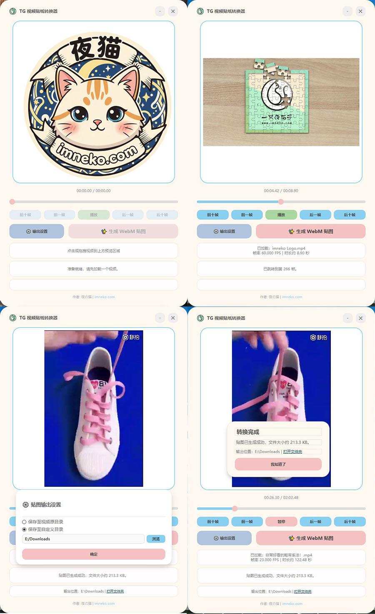

# TG Sticker Maker (Telegram 贴纸转换器) 

一款基于 Python 和 PyQt6 开发的 Windows 桌面工具，专门用于将普通视频轻松转换为符合 Telegram 标准的 WebM 动画贴纸。

## 📷 预览截图



## ✨ 核心特性
- **现代化 UI**：奶油色调无边框圆角设计，支持窗口拖拽及动画交互。
- **智能预览**：支持拖拽/点击加载视频，自动截取 2.9s 循环预览，画面流畅不卡顿。
- **硬核兼容**：完美兼容 30/60/120 FPS 等任意帧率视频，杜绝转码后的“加速感”。
- **支持格式**：.mp4, .mov, .mkv, .avi, .webm, .m4v, .flv, .wmv
- **自动压制**：内置码率迭代算法，确保输出文件严格小于 256KB 且符合 VP9 编码标准，画面长边 512px  短边等比缩放，输出帧率 29.975 FPS，符合 Telegram Sticker 贴图要求。
- **绿色便携**：支持环境依赖分离打包，启动迅速，不污染系统临时文件夹。

## 🛠️ 技术栈
- **语言**：Python 3.12+
- **界面**：PyQt6
- **视频处理**：OpenCV (cv2)
- **核心引擎**：FFmpeg

## 📂 项目结构
```text
TG_Sticker_Maker/
├── main.py             # 程序主代码
├── build.py            # 一键打包脚本
├── resources/          # 图标及 UI 素材
└── bin/                # 存放 ffmpeg.exe (需自行放入)
```

## 🧠 作者
夜の猫 (由 Gemini & Codex 协助开发) <br>
Telegram: @imnekosama <br>
网站：🌐 https://imneko.com